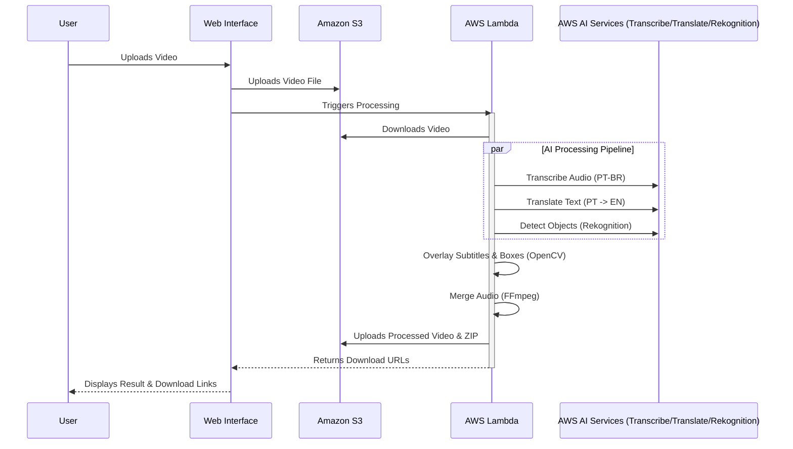

# 🎥 Serverless Video AI - Intelligent Video Processing Platform


**Serverless Video AI** is a cutting-edge cloud-native application designed to automate video analysis and enhancement. Leveraging the power of **AWS Serverless** architecture, this platform ingests user-uploaded videos, automatically transcribes audio, translates it into English, detects objects within the video frames, and overlays this information as dynamic subtitles and bounding boxes.

This project demonstrates a robust implementation of **Event-Driven Architecture**, **Computer Vision**, and **Natural Language Processing (NLP)** pipelines using managed cloud services.

---

## 🚀 Key Features

*   **Automatic Transcription**: Uses **Amazon Transcribe** to convert Portuguese audio into text with high accuracy.
*   **Neural Machine Translation**: Uses **Amazon Translate** to seamlessly translate the Portuguese transcript into English.
*   **Intelligent Object Detection**: Uses **Amazon Rekognition** to identify objects in the video that match keywords from the translated text.
*   **Dynamic Video Overlay**: Automatically burns subtitles and draws bounding boxes around detected objects using **OpenCV**.
*   **Smart Audio Merging**: Re-integrates the original audio with the processed video using **FFmpeg** for a complete viewing experience.
*   **Downloadable Results**: Generates a ZIP package containing the processed video and a CSV file with the original and translated transcripts.
*   **Serverless & Scalable**: Built on **AWS Lambda** and **Docker**, ensuring the application scales automatically with demand and incurs zero cost when idle.
*   **Modern UI**: Features a clean, glassmorphism-inspired web interface built with **Flask** and **HTML5/CSS3**.

---

## 🏗️ Architecture Overview

The application follows a fully serverless workflow:

1.  **Ingestion**: User uploads a video via the Web UI. The file is stored in **Amazon S3**.
2.  **Orchestration**: The Flask app (running on AWS Lambda) triggers parallel AI jobs.
3.  **AI Processing**:
    *   **Amazon Transcribe** generates the text transcript.
    *   **Amazon Translate** converts the text to English.
    *   **Amazon Rekognition** scans the video for labels/objects.
4.  **Video Processing**: The Lambda function downloads the video, uses **OpenCV** to overlay text and bounding boxes, and **FFmpeg** to merge audio.
5.  **Delivery**: The final video and metadata are zipped and uploaded back to S3. Presigned URLs are generated for secure user download.

### 📊 Workflow Diagram



---

## 🛠️ Technology Stack

*   **Backend Framework**: Python Flask (deployed via AWS Chalice/Lambda)
*   **Containerization**: Docker (for packaging Lambda dependencies)
*   **Cloud Provider**: Amazon Web Services (AWS)
    *   **Compute**: AWS Lambda
    *   **Storage**: Amazon S3
    *   **AI/ML**: Transcribe, Translate, Rekognition
    *   **Registry**: Amazon ECR
*   **Video Processing**: OpenCV (cv2), MoviePy, FFmpeg
*   **Frontend**: HTML5, CSS3, JavaScript
*   **CI/CD**: GitHub Actions

---

## 📋 Prerequisites

Before you begin, ensure you have the following installed:

*   **Git**: For version control.
*   **Docker Desktop**: Required for building the Lambda container image.
*   **AWS CLI**: Configured with your credentials (`aws configure`).
*   **Python 3.9+**: For local development.
*   **PowerShell**: For running the manual deployment script (Windows).

---

## ⚙️ Installation & Deployment

### Option A: Automated Deployment (GitHub Actions) - **Recommended**

This project is configured with **GitHub Actions** for Continuous Deployment.

1.  **Fork/Clone** this repository.
2.  Go to your repository **Settings** -> **Secrets and variables** -> **Actions**.
3.  Add the following repository secrets:
    *   `AWS_ACCESS_KEY_ID`: Your AWS Access Key.
    *   `AWS_SECRET_ACCESS_KEY`: Your AWS Secret Key.
    *   `S3_BUCKET`: The name of your S3 bucket (e.g., `my-video-app-bucket`).
4.  Push any change to the `main` branch. The workflow will automatically build the Docker image, push it to ECR, and update the Lambda function.

### Option B: Manual Deployment (PowerShell)

If you prefer to deploy from your local machine:

1.  **Clone the repository**:
    ```bash
    git clone https://github.com/Netinhoklz/video-translate-legend-detection.git
    cd video-translate-legend-detection
    ```

2.  **Configure Environment**:
    Create a `.env` file in the root directory:
    ```env
    AWS_ACCESS_KEY_ID=your_access_key
    AWS_SECRET_ACCESS_KEY=your_secret_key
    AWS_REGION=us-east-1
    S3_BUCKET=your-s3-bucket-name
    ```

3.  **Run Deployment Script**:
    ```powershell
    .\deploy.ps1
    ```
    This script will:
    *   Authenticate with AWS.
    *   Create/Configure the S3 Bucket (CORS).
    *   Create the ECR Repository.
    *   Build and Push the Docker Image.
    *   Update the AWS Lambda Function.

---

## 💻 Local Development

To run the Flask application locally for testing and UI development:

1.  **Install Dependencies**:
    ```bash
    pip install -r requirements.txt
    ```

2.  **Set Environment Variables**:
    Ensure your `.env` file is configured as shown above.

3.  **Run the Application**:
    ```bash
    python app.py
    ```

4.  **Access the App**:
    Open your browser and navigate to `http://localhost:8080`.

    *> **Note**: Local execution still requires valid AWS credentials to access S3 and AI services.*

---

## 📂 Project Structure

```text
.
├── .github/workflows/   # CI/CD Pipeline configurations
├── static/              # CSS and static assets
├── templates/           # HTML templates (Jinja2)
├── app.py               # Main Flask application & Logic
├── deploy.ps1           # Manual deployment automation script
├── Dockerfile.lambda    # Docker configuration for AWS Lambda
├── requirements.txt     # Python dependencies
└── README.md            # Project documentation
```

---

## 🛡️ License

This project is open-source and available under the **MIT License**.

---

<p align="center">
  Made with ❤️ by Netinho
</p>