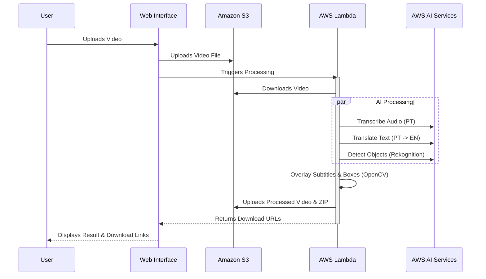

# Serverless Video AI 🎥🤖

This project is a **Serverless Video Processing Application** built with Python (Flask), Docker, and AWS Cloud services. It demonstrates the power of event-driven architecture and AI integration.

The application allows users to upload a video, which is then processed to:
1.  **Transcribe** audio from Portuguese to text (AWS Transcribe).
2.  **Translate** the transcription to English (AWS Translate).
3.  **Detect Objects** in the video that match the translated text (AWS Rekognition).
4.  **Overlay** subtitles and bounding boxes on the video.
5.  **Generate** a downloadable ZIP containing the processed video and a CSV transcript.

## 🚀 Architecture

The project leverages a fully serverless architecture on AWS:

*   **Frontend**: HTML5/CSS3 with a glassmorphism design, served by Flask.
*   **Backend**: Python Flask application running on **AWS Lambda** (containerized with Docker).
*   **Storage**: **Amazon S3** for storing input videos and processed results.
*   **AI Services**:
    *   **Amazon Transcribe**: Speech-to-Text.
    *   **Amazon Translate**: Machine Translation.
    *   **Amazon Rekognition**: Object & Label Detection.
*   **Deployment**: Automated via PowerShell script (`deploy.ps1`) using AWS CLI and Docker.

## 📊 Workflow Diagram



## 📂 Project Structure

*   `app.py`: Main Flask application containing all logic for S3 uploads, AI job orchestration, and video processing (OpenCV/MoviePy).
*   `deploy.ps1`: PowerShell automation script for building the Docker image, pushing to ECR, and updating the Lambda function.
*   `Dockerfile.lambda`: Docker configuration for packaging the app for AWS Lambda.
*   `templates/`: HTML templates for the web interface (`index.html`, `result.html`).
*   `static/`: CSS styles (`style.css`).
*   `requirements.txt`: Python dependencies.

## 🛠️ Prerequisites

*   **AWS Account** with appropriate permissions.
*   **AWS CLI** installed and configured (`aws configure`).
*   **Docker Desktop** installed and running.
*   **Python 3.9+**.
*   **PowerShell** (for the deployment script).

## ⚙️ Setup & Deployment

1.  **Clone the repository:**
    ```bash
    git clone https://github.com/Netinhoklz/video-translate-legend-detection.git
    cd video-translate-legend-detection
    ```

2.  **Configure Environment:**
    Create a `.env` file in the root directory with your AWS credentials (or ensure they are set in your environment):
    ```env
    AWS_ACCESS_KEY_ID=your_key
    AWS_SECRET_ACCESS_KEY=your_secret
    AWS_REGION=us-east-1
    S3_BUCKET=your-s3-bucket-name
    ```

3.  **Deploy to AWS:**
    Run the automated deployment script. This script handles ECR login, Docker build/push, and Lambda update.
    ```powershell
    .\deploy.ps1
    ```
    *Note: The script assumes a Lambda function named `trabalho_nuvem_final` exists. You may need to create it first or adjust the script.*

4.  **Access the App:**
    The script will output the **Function URL** at the end. Open this URL in your browser to use the application.

## 💻 Local Development

To run the application locally for testing:

1.  Install dependencies:
    ```bash
    pip install -r requirements.txt
    ```
2.  Run the Flask app:
    ```bash
    python app.py
    ```
3.  Access at `http://localhost:8080`.

## 📝 License

This project is for educational purposes.